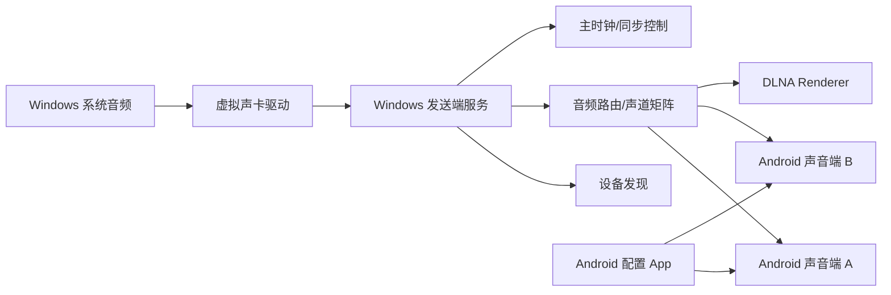

# 系统架构

## 1. 总览



## 2. 核心设计原则

- 控制信令和音频数据分离。
- 声卡模式优先低延迟和同步。
- DLNA 模式优先兼容性。
- 设备标识固定，别名可变。
- Windows 端作为主时钟和音频路由中心。
- Android 端专注接收、缓冲、同步和播放。

## 3. 模块关系

### Windows 发送端

Windows 发送端是系统主控：

- 管理设备发现。
- 管理设备列表、别名和启用状态。
- 维护声道映射。
- 接收系统音频。
- 生成音频包。
- 维护主时钟。
- 分发音频到各个声音端。

### Android 声音端

Android 声音端是播放节点：

- 注册和广播固定设备识别码。
- 接收配置命令。
- 接收音频流。
- 根据声道配置选择需要播放的声道。
- 根据 `play_at` 时间戳准时播放。
- 报告延迟、丢包、缓冲和播放状态。

### Android 配置 App

Android 配置 App 是移动管理端：

- 扫描局域网声音端。
- 修改声音端运行模式。
- 修改别名。
- 配置 DLNA 单机/多机模式。
- 配置声道角色和延迟补偿。

### Shared

`shared` 目录保存跨模块共享内容：

- 协议定义。
- 设备模型。
- 声道枚举。
- 错误码。
- 测试音频或测试向量。

## 4. 运行模式

### 电脑声卡模式

这是低延迟和多机同步的主模式：

```text
Windows 虚拟声卡 -> Windows 发送端 -> UDP/RTP 音频 -> Android 声音端
```

特点：

- 支持系统音频输出。
- 支持多设备声道分配。
- 支持主时钟同步。
- 支持低延迟优化。

### DLNA 单机模式

这是兼容模式：

```text
DLNA 控制器 -> Android 声音端 DLNA Renderer -> 本机播放
```

特点：

- 兼容普通 DLNA 控制器。
- 适合单设备播放。
- 延迟较高。
- 不保证多设备同步。

### DLNA 多机增强模式

这是兼容和同步之间的折中：

```text
DLNA 控制/发现 + 自定义同步协议 + 自定义播放调度
```

特点：

- 对外提供 DLNA 能力。
- 多机声道同步仍依赖自定义同步层。
- 适合需要多 Android 设备分别承担左右声道的场景。

## 5. 同步策略

多设备同步以 Windows 发送端为主时钟：

1. Windows 定期测量每台 Android 声音端的 RTT。
2. Android 回报本地时钟和缓冲状态。
3. Windows 估算每台设备的时钟偏移。
4. 音频包携带统一的播放时间。
5. Android 端按时间戳播放。
6. Android 端通过 jitter buffer 和微调播放速率处理漂移。

## 6. 延迟策略

预设三个档位：

| 模式 | 目标延迟 | 适合场景 |
|---|---:|---|
| 极速 | 20ms - 40ms | 强 WiFi、近距离、单设备 |
| 平衡 | 40ms - 80ms | 默认推荐 |
| 稳定 | 100ms - 200ms | 网络较差、多设备 |

